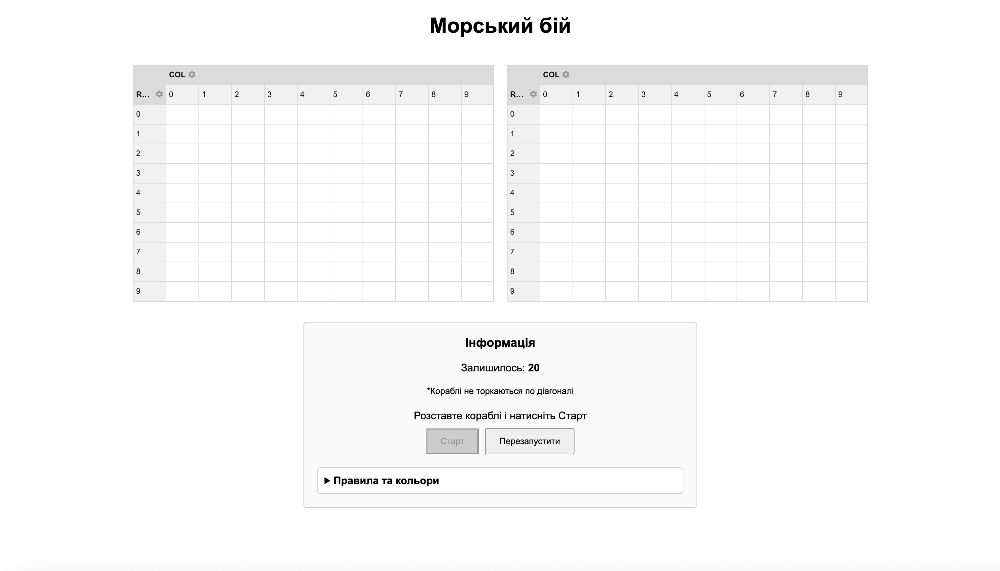

# Морський бій (Battleship Web)

**Грати онлайн:** [https://sofia-battleship.up.railway.app](https://sofia-battleship.up.railway.app)

## Про гру
Це веб-реалізація класичної гри "Морський бій" для двох гравців. Проєкт створено за допомогою Node.js, Express та Socket.io (для взаємодії в реальному часі). Ігрові поля відображаються за допомогою таблиць WebDataRocks.

## Логіка та архітектура
Гра розрахована строго на двох гравців. Кожен гравець має власну дошку розміром 10х10, яка програмно реалізована як двовимірна матриця (масив масивів 10 на 10).

Кожна клітинка в матриці може приймати одне з чотирьох числових значень:
* `0` — пусто (вода)
* `1` — палуба корабля
* `2` — влучання
* `3` — промах

**Флот (10 кораблів):**
* 1 шт. — 4 клітинки
* 2 шт. — по 3 клітинки
* 3 шт. — по 2 клітинки
* 4 шт. — по 1 клітинці

**Взаємодія:**
На своїй дошці гравець бачить абсолютно всі типи клітинок. На ворожій дошці гравець бачить усе, окрім клітинок зі значенням `1` (палуби суперника приховуються логікою на бекенді). Також діє правило валідації: кораблі не можуть торкатися один одного по діагоналі. Кожен корабель повинен бути оточений пустими клітинками.

**Позначення кольорів:**
* **Сірий** — ваш корабель
* **Червоний** — влучання у корабель
* **Світло-сірий** — промах (постріл у пустоту)

## Простір для покращення (Плани на майбутнє)
У поточній версії реалізована базова та надійна логіка. Для подальшого розвитку проєкту планується:
1. **Реалізація ігрових кімнат за унікальним ID** — дозволить грати кільком парам гравців одночасно на одному сервері (зараз гра підтримує лише одну активну пару).
2. **Удосконалена валідація форм кораблів** — перевірка того, що корабель вибудуваний строго в пряму лінію, а не "кутиком". У поточній версії діє спрощена логіка: перевіряється загальна кількість палуб (20) та відсутність дотиків по діагоналі, що покладає відповідальність за правильну форму на самих гравців.

## Автор
Проєкт виконала:  
студентка 1-го курсу КН-1 Софія Пруцька
